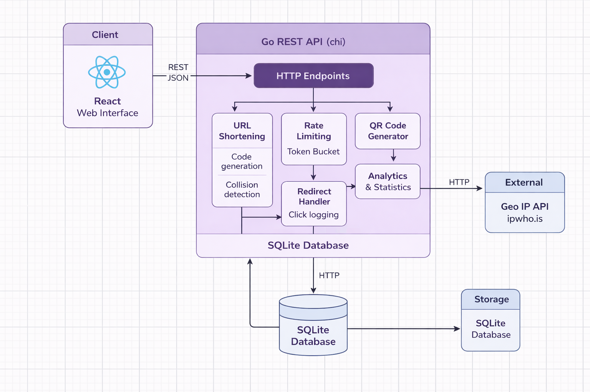

# ATAD

High-Level Diagram

# URL Shortener with Analytics

Shorty is a small full-stack URL shortener  built with **Go + React + SQLite**.
It turns a long URL into a short code (6–8 chars) and then tracks _real_ clicks so I can display analytics in a dashboard (total clicks, unique visitors, and clicks by country).

---

## What the user can do from the UI

- Paste a long URL and get a short link
- Optionally choose his own short code (custom slug)
- Optionally set an expiration date (expired links return **410 Gone**)
- Optionally generate a QR code (server-side, PNG returned as base64)
- View a list with all created links (+ basic stats)
- Open detailed stats for a code (clicks, unique visitors, countries)

---

## High-level architecture (how the pieces talk)

**React Web UI** → **Go REST API (chi)** → **SQLite (shorty.db)**

Important: the frontend never touches the database directly. Everything goes through the API.

### Why this architecture

I went with a classic client–server split because it’s the cleanest way to keep responsibilities separate:

- React handles _input + UI + visualization_
- Go handles _business logic + validation + security + analytics_
- SQLite stores _state_ (URLs + click events)

This also makes the project easier to refactor without breaking things, because each layer has a clear job.

---

## Request flow (what happens step-by-step)

### 1) Shorten flow (create link)

`POST /api/shorten`

1. React sends `{ url, custom_code?, expires_at?, want_qr }` as JSON
2. Backend validates URL + parses expires_at
3. If custom_code exists → validate + reject if already in DB
4. Else generate a secure random code (6–8 chars) and check collisions
5. Save into `urls` table
6. If want_qr = true → generate QR (PNG) and return it as a base64 data URI
7. React renders the result

Note: pressing **Shorten** only creates a URL row. It does _not_ create a click event.

### 2) Redirect flow (click tracking)

`GET /{code}`

1. Backend looks up `code` in `urls`
2. If not found → 404
3. If expired → 410 Gone
4. Extract client IP (X-Forwarded-For / X-Real-IP / RemoteAddr)
5. Hash IP (SHA-256 + salt) and optionally resolve country (Geo-IP API)
6. Insert a row into `click_events`
7. Respond with HTTP **302** redirect to the original URL

This endpoint is the “heart” of the system, because it guarantees analytics are real and server-side.

### 3) Stats flow (one code)

`GET /api/urls/{code}/stats`

- total clicks = COUNT(click_events)
- unique visitors = COUNT(DISTINCT ip_hash)
- clicks by country = GROUP BY geo_country

### 4) Dashboard list flow (all links)

`GET /api/urls`

- returns all stored links + basic analytics (clicks + uniques + expires)

---

## API endpoints (backend)

- `POST /api/shorten`
  Creates a short URL (random code or custom code). **Rate limited.**

- `GET /api/urls`
  Returns all stored URLs for the dashboard (with basic analytics).

- `GET /api/urls/{code}/stats`
  Returns detailed stats for one code (clicks, unique visitors, countries).

- `GET /{code}`
  Redirects to the original URL and stores a click event (**not rate limited**).

- `GET /`
  Health check ("Go URL shortener is running ")

---

## Why I used these technologies

### Go + chi (backend)

I used **chi** because it’s lightweight and clean:

- easy route definitions
- middleware-friendly (logger, recoverer, rate limiting)
- fits well for a small REST API

### SQLite + GORM (database)

I consider SQLite is perfect for my project:

- no extra server to install
- one local file (`shorty.db`)
- easy to inspect/debug

GORM helps because:

- automatic migrations (AutoMigrate)
- cleaner queries for counts and group-bys
- less boilerplate than raw SQL while still being readable

### React (frontend)

React is only for UI + requests:

- collects inputs (URL, custom code, expiration, QR toggle)
- calls backend endpoints with fetch
- displays results (tables, stats, QR image)

---

## How shortening works (and how I handle collisions)

- Codes are generated with `crypto/rand` (not predictable).
- Default length is 7, allowed range is 6–8 chars, alphanumeric.
- Before inserting, the backend checks if the code already exists.
- If a rare race condition still hits a UNIQUE constraint, the backend retries
  (only for generated codes, not for user-provided codes).

Why I did it this way:

- avoids sequential IDs (harder to guess)
- keeps links short and consistent
- collision probability is tiny, but still handled safely

---

## Click tracking (analytics are real, not “simulated”)

A click event is saved **only** when the redirect endpoint is called.
So: pressing "Shorten" creates a URL row, but it does NOT create a click event.

Each click event stores:

- `url_id` (foreign key to urls)
- timestamp
- hashed IP (`SHA-256(ip + salt)`)
- user agent
- referrer
- country (ISO-2) if available

Click logging is server-side, so analytics still work even if someone disables JS in the browser.

---

## Unique visitors (privacy-friendly)

I do not store raw IP addresses.
Instead, I hash the IP using SHA-256 + a salt, and unique visitors are computed as:

`COUNT(DISTINCT ip_hash)`

Why:

- simple and fast
- no cookies, no JS tracking required
- better for privacy (no raw IP in DB)

Limitation:

- users behind the same NAT (same Wi-Fi) might be counted as one unique visitor

---

## Geo analytics (country)

Country is resolved server-side using an external Geo-IP service (**ipwho.is**).

Flow:

- extract client IP (X-Forwarded-For / X-Real-IP / RemoteAddr)
- ignore private/loopback IPs (localhost, 192.168.x.x, 10.x.x.x, etc.)
- call `https://ipwho.is/<ip>` and read `country_code` (ISO-2)
- cache results in memory (TTL) to reduce external calls
- store `GeoCountry` in `click_events`

Local note:
If you test only on localhost, geo may be empty (private IP).
Using a tunnel (ngrok) or a real deployment gives public IPs and real geo data.

---

## QR codes

If `want_qr` is true, the backend generates a QR code for the short link and returns it as:

`data:image/png;base64,...`

So the frontend can display it directly in an `` without extra libraries.

Scanning the QR hits the same redirect endpoint, so it is tracked like a normal click
(as long as the scan opens the URL in a browser).

---

## Rate limiting (token bucket per IP)

I rate limit the API endpoints to prevent abuse (e.g., someone spamming `/api/shorten`).

Implementation: **token bucket per IP**

- capacity: 10 tokens
- refill: 10 tokens/minute
- when empty: **429 Too Many Requests** + `Retry-After` header

Why token bucket:

- allows small bursts (more user-friendly)
- avoids the “minute boundary” issue of fixed-window counters
- lightweight (no Redis needed)

Important:
The redirect endpoint `GET /{code}` is **NOT** rate limited, because the whole point is that many people can open a shared link without getting blocked.

---

## Database schema (SQLite)

Tables:

- `urls`
  - code (unique)
  - original
  - created_at
  - expires_at (nullable)

- `click_events`
  - url_id
  - created_at
  - ip_hash
  - user_agent
  - referrer
  - geo_country (nullable)

---

## How to run (local dev)

### Backend

1. `cd backend`
2. `go mod download`
3. `go run .`

Backend runs on `http://localhost:8080` and creates `shorty.db` automatically.

### Frontend

1. `cd frontend`
2. `npm install`
3. `npm start`

Frontend runs on `http://localhost:3000`

CRA proxy:
The React app uses a proxy to the backend, so calls like `fetch("/api/shorten")` automatically go to `localhost:8080`.

---

## Regression test checklist (what I test after refactors)

1. Shorten URL (random code)

- Submit a valid https:// URL
- Expect: 201 + short_url + code

2. Custom code

- Submit custom_code
- Expect: 201
- Submit same custom_code again
- Expect: 409 conflict

3. Expiration

- Create a link with expires_at in the past
- Open short link
- Expect: 410 Gone
- Create link with expires_at in the future
- Expect: redirect works

4. Redirect + click logging

- Open short link in a browser
- Expect: 302 redirect
- Expect: click_events row added
- Expect: stats clicks increments

5. Unique visitors

- Open same short link twice from the same device/IP
- Expect: clicks increases, unique_visitors stays the same

6. Geo by country

- Open short link from a public IP (ngrok or another network)
- Expect: click_events.geo_country is filled
- Expect: stats show a non-empty Countries map

7. QR code

- Create a link with want_qr = true
- Expect: QR image displays in UI
- Scan QR and open it
- Expect: click event recorded

8. Rate limiting

- Spam POST /api/shorten (11+ times within a minute)
- Expect: some requests return 429

9. Dashboard list

- Refresh list
- Expect: all URLs appear with clicks/unique and expires

---

## Limitations / next improvements

- Rate limiter + geo cache are in-memory (reset on restart). For multi-instance production I'd move to Redis.
- SQLite is not ideal for high concurrency (fine for this scope).
- IP-based uniqueness is approximate (NAT limitation).
- No background cleanup job for expired URLs (easy future enhancement).
